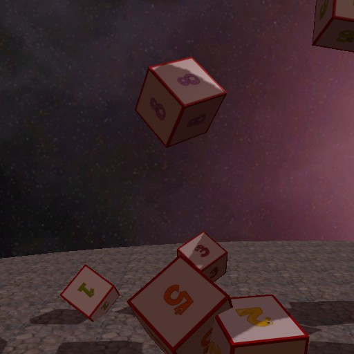
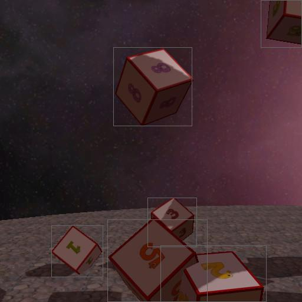

# DS2Data

A Space Sim inspired data set to experiment with machine learning.

The objects of interest are cubes with a number on them. You may think of it as
a 3D version of the [MNIST](http://yann.lecun.com/exdb/mnist/) data set.

In addition to the training samples, the data also contains pre-rendered flight
through a 3D space scene.

The meta data for the flight is in `flightpath/meta.pickle`. It contains, among
other things, the screen position of each cube in each frame. The
`draw_bboxes.py` script shows how to use this information to draw bounding
boxes around all cubes.

| Original Scene               | After `draw_bboxes.py`      |
| ---------------------------- | --------------------------- |
| | |

# Installation
Download the [dataset](ds2.tar.gz) and use it in your ML model as you see fit.

# License
The data set and code are available under the Apache Software License 2.0.

# Disclaimer
The numeral textures are royalty free images
from
[PixaBay](https://pixabay.com/en/photos/?hp=&image_type=&cat=&min_width=&min_height=&q=counting+math+numbers+numerals+funny&order=popular).
The rendered images were created with
[PyHorde](https://github.com/olitheolix/pyhorde).

# Results
My own models are in the `models/` folder. The results are documented
[here](https://olitheolix.github.io/ds2data/)

# Feeback
I would be happy to hear from anyone who uses it. Does it work for you? Is
something missing? Which ML models have you built for it and how well did they
do?
