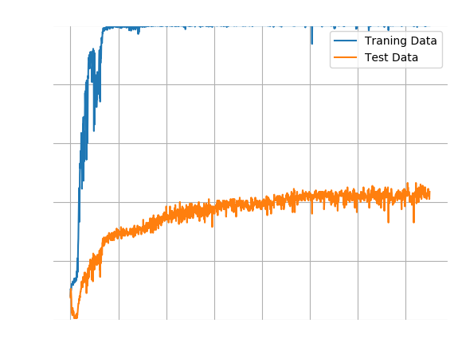
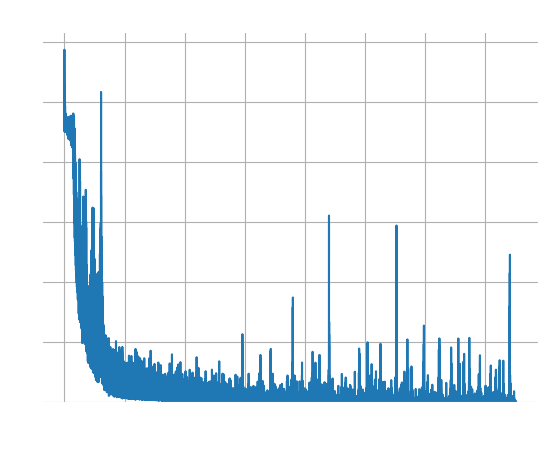
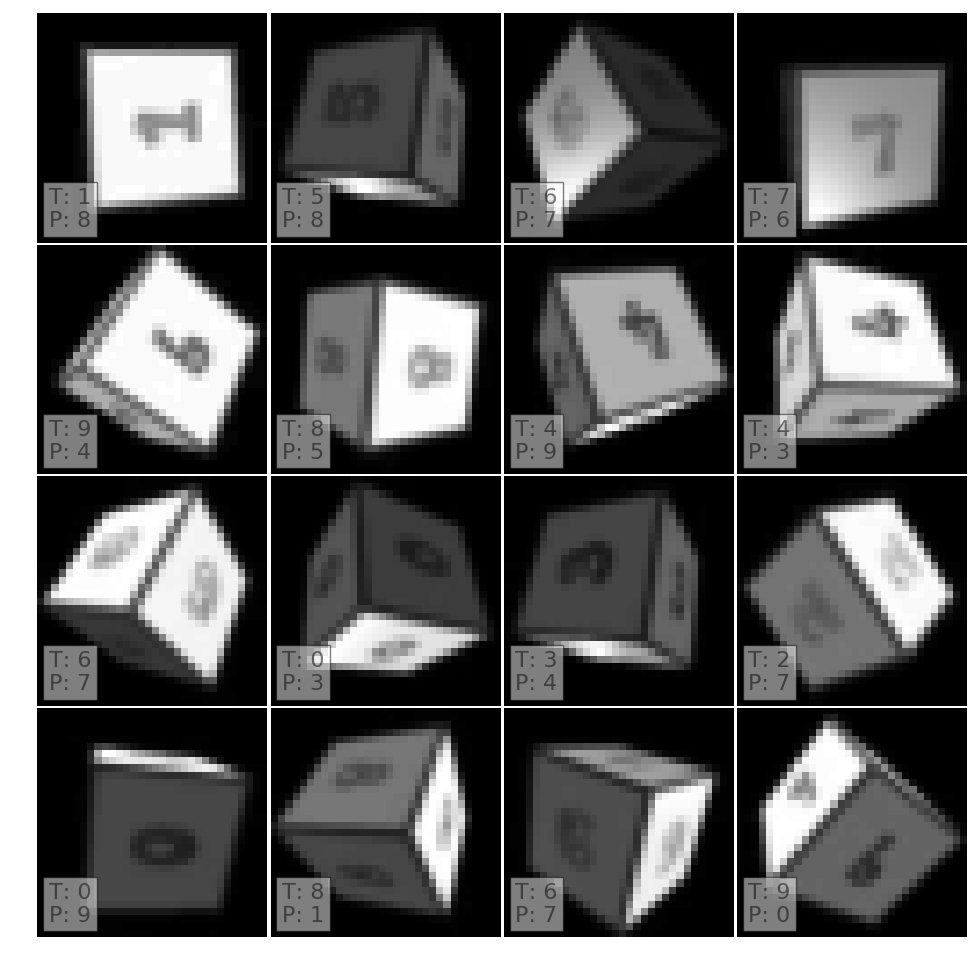

# Gray Scale Images

The [previous article](a_simple_rgb) trained the network on RGB images and
found that the network relies too heavily on colour to identify the numbers.
We will therefore repeat the test with Gray scale images.

This network overfits the data because it correctly labels all training
data but only ~40% of the test data.

A brief look at some of the mislabelled images confirms that the network does
not "recognise" digits. It struggles even with well lit numbers that face the
camera directly.

One possible explanation is the small training set. Unlike MNIST, data set
comprises only 100 images for each label. Furthermore, each number is
projected onto an randomly aligned cube in 3D space under different lighting
conditions. A larger (or augmented) training set may therefore alleviate the
problem. On the other hand, I have no difficulty to identify the images and
feel the network should do better than 40%.
