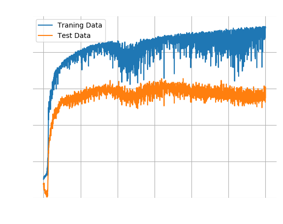
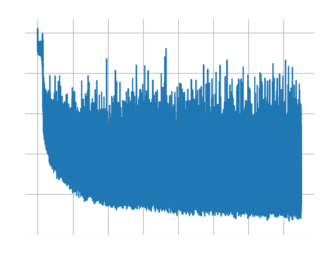
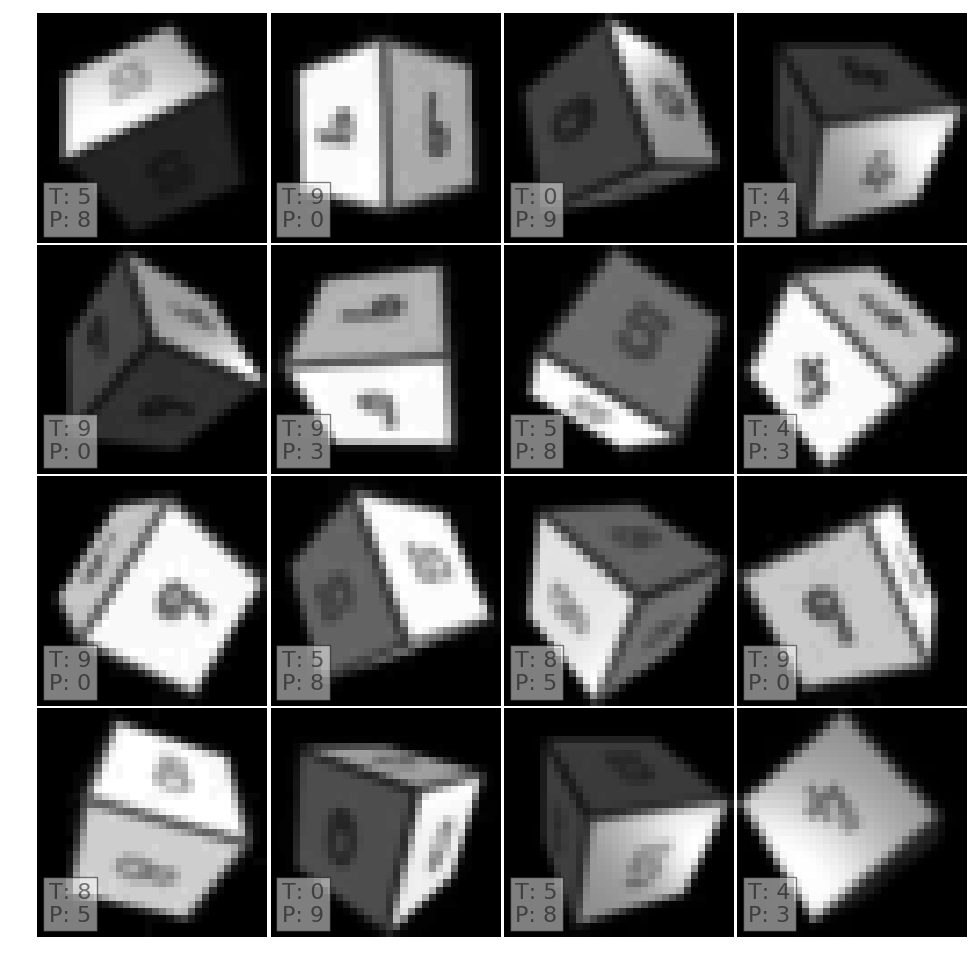

# Small Network Without SPT

The [last post](a_simple_gray_transformer_small) showed that a network with a
smaller dense layer improves the accuracy. Since that network had a spatial
transformer network we will run one last experiment in this series and drop the
spatial transformer.

Without further ado, here are the results. The cost fluctuates widely and the
classification accuracy also does not converge well. Overall, at <60% accuracy,
the performance without an SPT is worse than with an SPT.

As usual, here are some mislabelled examples.

