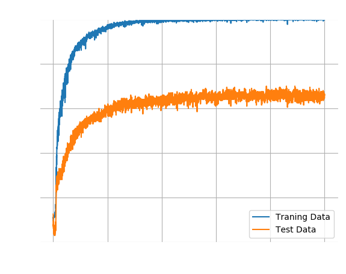
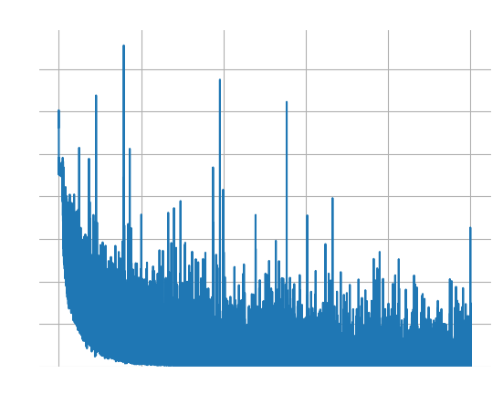
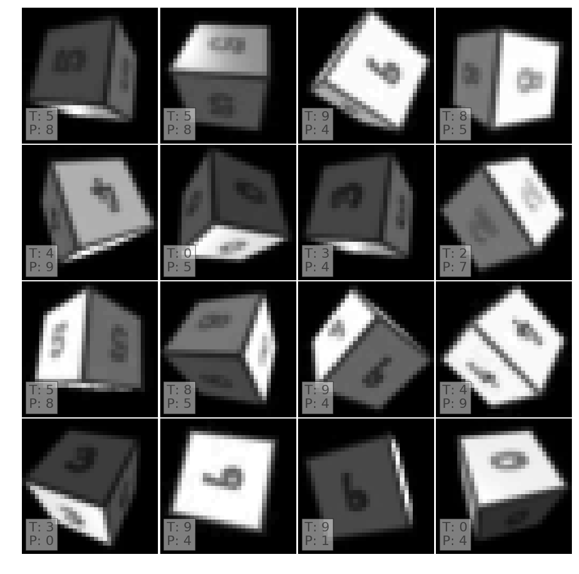

# Spatial Transformer Network (SPT)

The poor results of the previous experiment points towards a too small training
set. This is plausible but inconclusive. Furthermore, the data set is set in
stone for now.

If the problem is really that the network does not see enough samples at enough
angles, then a [spatial transformer network](https://arxiv.org/abs/1506.02025)
may help. Its purpose is simple: identify one or more regions of interest and
normalise it. In this particular context it would mean to identify the region
with the number and then rotate and stretch it so that it closely matches one
of the training images.

The result is encouraging because the classification accuracy jumps from ~40%
to ~60% - without any change to the training set!

An accuracy of 60% is nothing something to brag about. Nevertheless, the
experiment certainly suggests that "more data" is not the only
answer to improve performance. Before we move to the next article to explore
this further, here are some mislabelled examples for this network.

