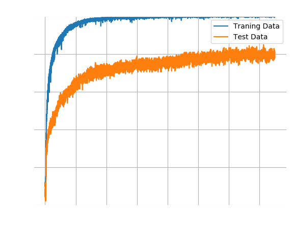
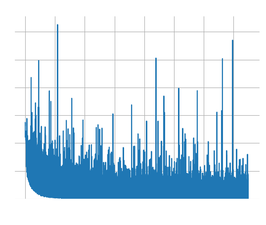
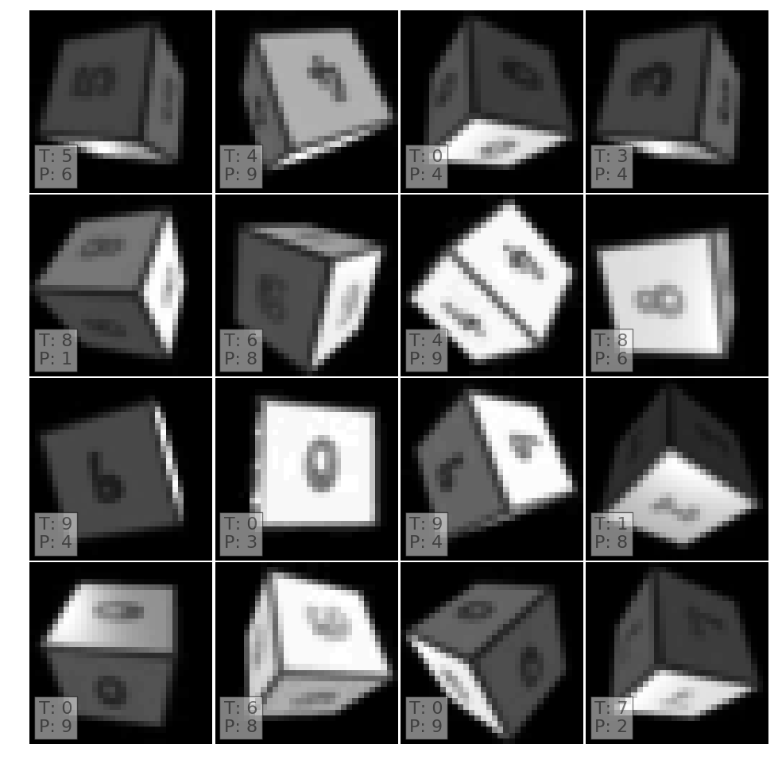

# Small Network With SPT

The addition of a spatial transformer network
noticeably [improved the results](a_simple_gray_transformer).
The question therefore is: can we make other changes to the network?

Without a doubt we could make everything bigger - more layers, more filters,
more neurons. This immediately poses the risk of over-fitting because our data
set is tiny.

We will therefore do the opposite of what all the cool kids are doing and make
the network *smaller*. Maybe it was already over-fitting and fewer parameters
would improve its inference capability.

For this experiment in particular we will keep the spatial transformer network
and its 20 region proposals. The filter layers also remain unchanged but the
dense layer only has 32 neurons instead of 128.

The accuracy of its bigger brother had converged after 5,000 epochs to ~65%. In
contrast, this smaller network takes 15,000 epochs to converge but achieves an
accuracy of 80%. This is the best accuracy we have seen so far for Gray scale
images (the accuracy for RGB images was ~90%).

Recall that the RGB network confused numbers with similar colours. In contrast,
the mislabelled examples do not exhibit any obvious pattern. In fact, the 16
mislabelled images below show all numbers except a "2", and the predictions
also include all numbers except "5" and "7". 16 samples are too few for a
meaningful conclusions, but what we do see is certainly encouraging.

