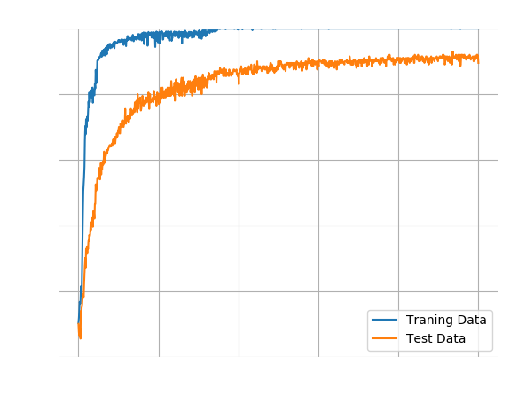
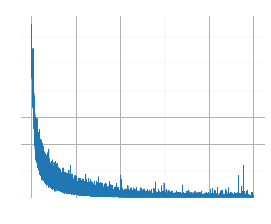
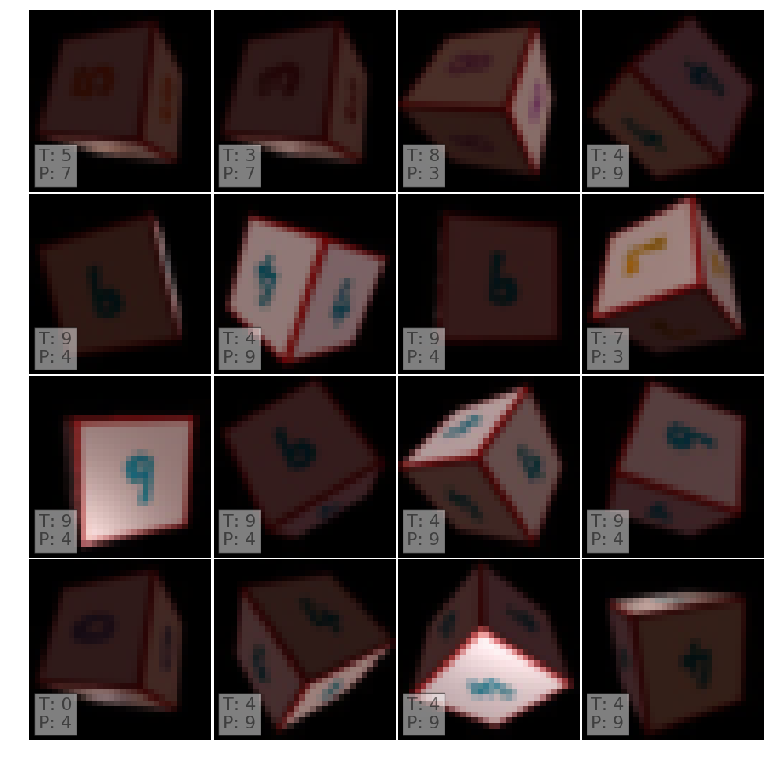

# RGB Images

This experiment uses the default configuration with 128 neurons in the dense
layer. The input images were scaled down to 32x32 pixels but all three colour
channels remain intact.

After 1000 epochs of training it recognises all training images and ~90% of the
test images.

Here are some of the mislabelled images. Note how it confuses numbers with
similar colours, for instance 4 and 9. This suggests that the network
figured out connection between colour and number, but not the connection
between shape and number.

